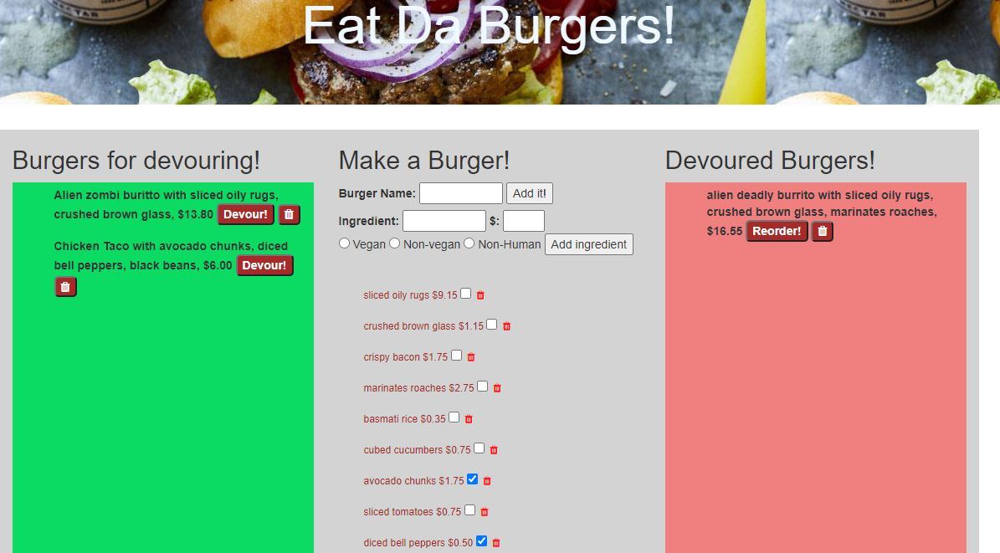

   
# Title : Eat-Da-Burger

## Description
Author: Jivko Atanassov

Everyone needs an access to a good burger joint. Eat Da burger is the perfect place, here you can order any kind of a burger you may want  and it will be ready in milliseconds. It is good for messy burger consumers as the mustard and ketchup never drip and your clothes stay perfectly clean even after the wildest burger. You can devour as many as you want and the burgers are kind on the waistline. True zero calorie material. And it costs nothing. Bon Appetite.

Github User name: zhim57@yahoo.com

## Table of Contents:
- [Title](#title)
- [Description](#description)
- [Table of Contents](#table-of-contents)
- [Installation](#installation)
- [Usage](#usage)
- [License](#licence)
- [Contributing](#contributing)
- [Tests](#tests)
- [Questions](#questions)

## Installation
npm add express express-handlebars mysql , then run node index
## Usage
- Web development/front end
- Node.js  application
- Web development back end
- Database Application
- entertainment application
- other
It is also a motivational app. It prompt the user that anything is possible and only there own wild desire for creativity is the limiting factor here. 
## Email
zhim57@yahoo.com
## Contributing
none
## License

## Tests
functionality test

## Questions
please email Jivko Atanassov with any questions at: zhim57@yahoo.com. Thank You.

## Links

[link to this portfolio](https://github.com/zhim57/Eat-Da-Burger)

[link to the deployed application](https://afternoon-wildwood-19991.herokuapp.com/)
  

## Screenshots

  
